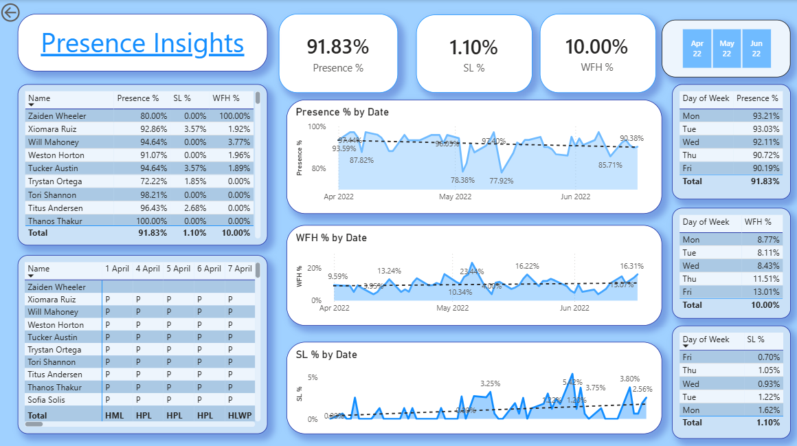

# HR Analytics & Attendance Dashboard

A real-world **HR Data Analytics project using Microsoft Power BI, Power Query, Excel, and DAX** to analyze employee attendance, work-from-home behavior, presence trends, and sick leave patterns.

The project converts raw monthly attendance data stored across multiple Excel sheets into a clean analytical dataset and then uses Power BI to build an interactive HR dashboard.

> **Project Type:** Data Analytics / Business Intelligence
> **Domain:** Human Resources (HR)
> **Tools:** Microsoft Power BI, Power Query, DAX, Microsoft Excel
> **Dataset:** Employee attendance data
> **Dashboard:** Interactive Power BI report

---

# 📊 Project Overview

This project focuses on analyzing employee attendance data using Power BI.

The original data is stored in Excel across multiple monthly sheets. Each sheet contains employee information in rows and dates in separate columns.

For example:

```text
Employee Code | Employee Name | Apr 1 | Apr 2 | Apr 3 | Apr 4 | ...
```

The next month's sheet has a similar structure, but the date columns change:

```text
Employee Code | Employee Name | May 1 | May 2 | May 3 | May 4 | ...
```

Simply appending these sheets is problematic because the date columns are different.

Therefore, the project uses **Power Query transformations** to convert the wide attendance data into a normalized structure:

```text
Employee Code | Employee Name | Date | Attendance Status
```

This structure is much easier to analyze using Power BI and DAX.

The original project specifically emphasizes bringing dates that are spread across multiple columns into a **single Date column** before performing analysis.

---

# 🎯 Business Problem

HR teams and management need answers to questions such as:

* How many employees are present?
* What percentage of employees are present?
* How frequently are employees working from home?
* Which days have the highest WFH preference?
* Is WFH increasing or decreasing over time?
* What percentage of working days are affected by sick leave?
* Are there unusual spikes in sick leave?
* Which employees have unusually high or low attendance?
* Which weekdays have the highest employee presence?
* Can attendance trends help with office capacity planning?

The stakeholders specifically wanted to understand **working preference between office and home, attendance percentage, and sick-leave patterns**.

---

# 🎯 Project Objectives

The main objectives are:

1. Combine attendance data from multiple monthly Excel sheets.
2. Clean and transform the raw attendance data using Power Query.
3. Convert multiple date columns into a single Date column.
4. Create reusable Power Query transformations for future months.
5. Create DAX measures for HR KPIs.
6. Analyze employee presence and WFH behavior.
7. Analyze sick-leave trends.
8. Identify weekday-level attendance patterns.
9. Build an interactive Power BI dashboard.
10. Provide management with actionable attendance insights.

---

# ❓ Business Questions

The dashboard is designed to answer the following questions.

### Attendance

* What is the overall presence percentage?
* How does presence change month by month?
* How does presence change over time?
* Which employees have low attendance?

### Work From Home

* What percentage of present days are WFH days?
* Is WFH increasing or decreasing?
* Which weekdays have the highest WFH preference?
* Which employees have a high WFH percentage?

### Sick Leave

* What percentage of working days are affected by sick leave?
* Is sick leave increasing?
* Are there specific periods with unusually high sick leave?
* Which employees have higher sick-leave percentages?

### Workforce Planning

* Which days have the highest employee presence?
* Which days are best for team activities?
* Can WFH patterns help with office capacity planning?
* Can attendance trends support future hybrid-work decisions?

The original stakeholder discussion specifically identifies Monday/Friday WFH patterns, office capacity planning, team activities, and sick-leave spikes as potential business applications.

---

# 📁 Dataset

The project uses employee attendance data stored in Excel.

The provided dataset contains attendance information for multiple months of a fiscal year, with the initial analysis using three months of data.

The employee names and IDs in the dataset are randomized, while the attendance data represents a realistic HR use case.

### Original Data Structure

The raw Excel sheets are in a wide format:

| Employee Code | Employee Name | Date 1 | Date 2 | Date 3 | ... |
| ------------- | ------------- | ------ | ------ | ------ | --- |
| EMP001        | Employee A    | P      | WFH    | P      | ... |
| EMP002        | Employee B    | SL     | P      | WFH    | ... |

This format is not ideal for Power BI analysis because every date is stored as a separate column.

### Final Data Structure

After Power Query transformation:

| Employee Code | Employee Name | Date   | Value |
| ------------- | ------------- | ------ | ----- |
| EMP001        | Employee A    | 01-Apr | P     |
| EMP001        | Employee A    | 02-Apr | WFH   |
| EMP001        | Employee A    | 03-Apr | P     |
| EMP002        | Employee B    | 01-Apr | SL    |

This creates a proper row-level attendance dataset.

---

# 🏷️ Attendance Codes

The attendance data uses short codes to represent employee status.

Examples mentioned in the project include:

| Code          | Meaning             |
| ------------- | ------------------- |
| `P`           | Present             |
| `WFH` / `WO`  | Work From Home      |
| `HWFH` / `HO` | Half Work From Home |
| `SL`          | Sick Leave          |
| `HSL`         | Half Sick Leave     |
| `PL`          | Paid Leave          |
| `WO`          | Weekly Off          |

**Important:** Use the exact codes present in your Excel dataset when implementing the project. The transcript contains some speech-to-text inconsistencies in the attendance abbreviations, so verify the actual Excel values before creating DAX logic.

---

# 🛠️ Technology Stack

### Microsoft Excel

Used as the source of employee attendance data.

### Power BI Desktop

Used to:

* Import data
* Build the data model
* Create DAX measures
* Create visualizations
* Build the final dashboard

### Power Query

Used for:

* Data cleaning
* Reshaping
* Removing unnecessary rows/columns
* Promoting headers
* Converting date columns
* Creating reusable transformations
* Combining monthly sheets

Power Query is essentially the data-preparation layer of the project. The project uses it to transform the Excel structure before loading the final table into Power BI.

### DAX

Used to create:

* Total Working Days
* Present Days
* Work From Home Count
* Presence Percentage
* Work From Home Percentage
* Sick Leave Count
* Sick Leave Percentage
* Additional calculated columns

---

# 🔄 Project Workflow

```text
Raw Excel Attendance Files
            ↓
      Power Query
            ↓
     Data Cleaning
            ↓
   Reshape / Unpivot
            ↓
Reusable Transformation
            ↓
     Final Data Table
            ↓
       DAX Measures
            ↓
   Power BI Visualizations
            ↓
      HR Dashboard
            ↓
 Business Insights
```

---

# Step 1 – Understand the Business Requirements

Before opening Power BI, identify what the stakeholders actually need.

The key requirements are:

### 1. Presence Analysis

Measure the percentage of employee working days where employees were present.

### 2. WFH Analysis

Measure how frequently employees work from home.

### 3. Sick Leave Analysis

Monitor sick leave and identify unusual patterns.

### 4. Day-Level Analysis

Determine whether employees prefer WFH on specific weekdays.

### 5. Employee-Level Analysis

Allow management to drill down into individual employees.

### 6. Trend Analysis

Understand how attendance, WFH, and sick leave change over time.

A key lesson from the project is that dashboard development should begin with **business questions**, rather than immediately creating charts.

---

# Step 2 – Import the Excel Data

Open **Power BI Desktop**.

Go to:

```text
Home
  → Get Data
  → Excel
```

Select the attendance Excel workbook.

Instead of immediately loading individual sheets into Power BI, select:

```text
Transform Data
```

This opens the **Power Query Editor**.

---

# Step 3 – Transform the Data using Power Query

The raw monthly sheets have different date column names.

For example:

```text
April:
Apr 1 | Apr 2 | Apr 3 | Apr 4 | ...

May:
May 1 | May 2 | May 3 | May 4 | ...

June:
Jun 1 | Jun 2 | Jun 3 | Jun 4 | ...
```

Appending these directly would not produce a clean analytical structure.

The solution is to transform the data so all dates appear in one column.

---

## 3.1 Select a Template Sheet

Use one monthly sheet as the transformation template.

For example:

```text
April
```

The transformation applied to this template will later be converted into a reusable function.

---

## 3.2 Promote the Correct Header

If the actual column headers are one row below the first row:

```text
Transform
→ Use First Row as Headers
```

---

## 3.3 Remove Unnecessary Rows

Remove rows that contain:

* Extra titles
* Empty rows
* Unnecessary information
* Reference information

Use:

```text
Remove Rows
→ Remove Top Rows
```

---

## 3.4 Rename Important Columns

Rename the employee-related fields consistently:

```text
Employee Code
Employee Name
```

The remaining date columns should eventually be converted into rows.

---

# Step 4 – Create a Reusable Power Query Function

This is one of the most important parts of the project.

The goal is **not** to manually clean April, then manually clean May, then manually clean June.

Instead:

```text
Transformation
      ↓
Template
      ↓
Power Query Function
      ↓
Apply Function
      ↓
April
May
June
Future Months
```

This makes the process reusable when new monthly sheets are added.

The project creates a template and turns the transformation into a reusable function so the same process can be applied to future sheets.

---

## Why a Function?

Suppose July is added later.

Without a function:

```text
Clean April
Clean May
Clean June
Clean July
Clean August
...
```

With a function:

```text
Create transformation once
        ↓
Apply to every sheet
```

This is the Power Query equivalent of reusable logic.

---

# Step 5 – Convert Date Columns into Rows

This is the critical transformation.

Select:

```text
Employee Code
Employee Name
```

Then choose:

```text
Transform
→ Unpivot Columns
→ Unpivot Other Columns
```

This converts:

```text
Employee | Apr 1 | Apr 2 | Apr 3
```

into:

```text
Employee | Date | Value
```

For example:

```text
Employee A | Apr 1 | P
Employee A | Apr 2 | WFH
Employee A | Apr 3 | P
```

The project specifically uses this approach to bring all dates into a single column, making the data much easier for Power BI to analyze.

---

# Step 6 – Handle Non-Date Columns Dynamically

The workbook may contain columns that are not actual attendance dates.

Instead of manually removing every unwanted column, a more dynamic approach is used.

Convert the date field to the appropriate **Date** data type.

Values that cannot be converted to dates become errors.

Then:

```text
Right Click Column
→ Remove Errors
```

This allows future non-date values to be handled automatically rather than manually removing individual columns.

The project deliberately looks for a dynamic transformation so that future changes to the Excel sheet do not require rebuilding the query.

---

# Step 7 – Create the Final Attendance Table

After applying the reusable function to all monthly sheets, expand the resulting data.

The final table should contain approximately:

```text
Employee Code
Employee Name
Date
Value
```

A sheet/source column can optionally be retained for validation or reference.

The template query itself should not necessarily be loaded into the Power BI model.

Only the final transformed dataset should be loaded.

The project follows this approach by disabling the template query's load and loading the final combined dataset instead.

---

# Step 8 – Validate the Data

Never start building the dashboard immediately after transformation.

First validate the data.

### Check 1 – Random Employee

Select a random employee.

Compare the Power BI record against the original Excel sheet.

### Check 2 – Random Date

Select a random date and verify the attendance value.

### Check 3 – Monthly Data

Verify April, May, and June individually.

### Check 4 – Data Types

Confirm:

```text
Employee Code → Text
Employee Name → Text
Date          → Date
Value         → Text
```

### Check 5 – Blank/Future Dates

Make sure dates for which attendance data does not yet exist are not incorrectly treated as absence.

The project explicitly performs random checks against the original Excel data before moving to dashboard creation.

---

# Step 9 – Create DAX Calculations

Create a separate table for measures.

For example:

```text
Measures
```

This keeps the data table clean and makes the Power BI model easier to understand.

The project recommends keeping measures in a separate measure table.

---

## 9.1 Total Working Days

The first requirement is to exclude weekly-off records from the total.

Conceptually:

```DAX
Total Working Days =
Total Attendance Records
    - Weekly Off Records
```

A representative implementation is:

```DAX
Total Working Days =
VAR TotalDays =
    COUNTROWS('Final Data')

VAR NonWorkingDays =
    CALCULATE(
        COUNTROWS('Final Data'),
        'Final Data'[Value] IN {"WO", "HO"}
    )

RETURN
    TotalDays - NonWorkingDays
```

Adjust the codes to match your actual dataset.

The original project uses `CALCULATE` to count non-working-day records and subtract them from the total.

---

# 9.2 Work From Home Count

Because WFH and half-WFH represent different amounts of working time, create a calculated column.

Example:

```DAX
Work From Home Count =
SWITCH(
    'Final Data'[Value],
    "WFH", 1,
    "HWFH", 0.5,
    0
)
```

This means:

```text
WFH   → 1 day
HWFH  → 0.5 day
Other → 0
```

This approach prevents a half-WFH day from being incorrectly counted as a complete WFH day.

---

## 9.3 Work From Home Days

```DAX
Work From Home Days =
SUM('Final Data'[Work From Home Count])
```

---

# 9.4 Present Days

The business definition of presence includes:

* Present
* Full WFH
* Half WFH
* Other valid working statuses

A half-WFH day should contribute partially rather than being treated as a full WFH day.

The project explicitly distinguishes between a full working day and a half WFH day when calculating presence.

A representative implementation can therefore be built around the status definitions in your actual dataset.

---

# 9.5 Presence Percentage

```DAX
Presence % =
DIVIDE(
    [Present Days],
    [Total Working Days],
    0
)
```

Format this measure as:

```text
Percentage
```

---

# 9.6 Work From Home Percentage

The WFH percentage is calculated relative to **present days**, not total working days.

```DAX
WFH % =
DIVIDE(
    [Work From Home Days],
    [Present Days],
    0
)
```

This answers:

> Out of the days employees were present, how many were worked from home?

The project explicitly uses present days as the denominator for the WFH percentage.

---

# 9.7 Sick Leave Count

Create a calculated column:

```DAX
Sick Leave Count =
SWITCH(
    'Final Data'[Value],
    "SL", 1,
    "HSL", 0.5,
    0
)
```

Therefore:

```text
SL  → 1
HSL → 0.5
Other → 0
```

The source project uses the same full-day/half-day logic for sick leave.

---

# 9.8 Sick Leave Days

```DAX
Sick Leave Days =
SUM('Final Data'[Sick Leave Count])
```

---

# 9.9 Sick Leave Percentage

```DAX
Sick Leave % =
DIVIDE(
    [Sick Leave Days],
    [Total Working Days],
    0
)
```

The project chooses total working days as the denominator for the sick-leave percentage because the objective is to monitor sick-leave patterns across the working period.

---

# 9.10 Month Column

For monthly filtering and analysis, create a month-level field.

A representative DAX calculation:

```DAX
Month =
FORMAT(
    'Final Data'[Date],
    "MMM YY"
)
```

Alternatively, create a proper month-start date:

```DAX
Month Start =
DATE(
    YEAR('Final Data'[Date]),
    MONTH('Final Data'[Date]),
    1
)
```

Using a real date column for sorting is preferable when creating chronological charts.

---

# 9.11 Day of Week

To analyze weekday behavior:

```DAX
Day of Week =
FORMAT(
    'Final Data'[Date],
    "dddd"
)
```

For correct Monday-to-Sunday sorting, create:

```DAX
Day Number =
WEEKDAY(
    'Final Data'[Date],
    2
)
```

Then in Power BI:

```text
Select Day of Week
→ Column Tools
→ Sort by Column
→ Day Number
```

This prevents Power BI from sorting weekdays alphabetically.

---

# 📊 Dashboard Design

The dashboard should focus on the most important business KPIs first.

The source project recommends placing the most important insights in the top-left area and then providing supporting detail underneath.

---

## KPI Cards

Create cards for:

```text
Presence %
WFH %
Sick Leave %
```

These provide an immediate overview of workforce attendance.

---

## Employee-Level Table

Create a table containing:

```text
Employee Name
Presence %
WFH %
Sick Leave %
```

This allows management to move from the overall KPI to individual employee-level analysis.

The project uses an employee table specifically to provide this granular view.

---

# 📈 Trend Analysis

Create line charts for:

### Presence Trend

```text
X-axis → Date / Month
Y-axis → Presence %
```

### WFH Trend

```text
X-axis → Date / Month
Y-axis → WFH %
```

### Sick Leave Trend

```text
X-axis → Date / Month
Y-axis → Sick Leave %
```

Trend charts are important because a single KPI cannot show whether attendance is improving or declining.

The project adds trend charts after the stakeholder identifies that monthly KPI cards alone require manually comparing different months.

---

# 📅 Weekday Analysis

Create a weekday visual using:

```text
Day of Week
WFH %
```

This helps identify whether employees are more likely to work from home on:

```text
Monday
Tuesday
Wednesday
Thursday
Friday
```

The project identifies Thursday/Friday as days with relatively high WFH preference in its example analysis.

---

# 🎛️ Slicers

Useful slicers include:

* Month
* Date
* Employee Name
* Day of Week

This allows management to move between:

```text
Overall
   ↓
Month
   ↓
Date
   ↓
Employee
```

---
## 🧩 Dashboard Layout

The dashboard is structured to provide a clear overview of employee attendance, WFH behavior, sick leave, and employee-level metrics.



---

## 🔎 Data Validation in the Dashboard

The dashboard calculations were validated against the underlying attendance data to ensure that the reported KPIs and employee-level values were consistent with the source records.

For example, an individual attendance record can be cross-checked between the source Excel data and the Power BI model:

```text
Excel
Employee A
10 June
P
---

# 🚀 How to Reproduce the Project

## Prerequisites

Install:

1. Microsoft Power BI Desktop
2. Microsoft Excel

Power BI Desktop is sufficient for creating the report locally.

---

## Step 1 – Clone the Repository

```bash
git clone https://github.com/<your-username>/<your-repository>.git
```

Move into the project:

```bash
cd <your-repository>
```

---

## Step 2 – Open the Dataset

Navigate to:

```text
data/
```

Open the attendance Excel workbook.

Make sure the workbook contains the required monthly attendance sheets.

---

## Step 3 – Open Power BI

Open:

```text
powerbi/HR_Analytics_Dashboard.pbix
```

If building the project from scratch, create a new Power BI report.

---

## Step 4 – Import Excel

Use:

```text
Home
→ Get Data
→ Excel
→ Transform Data
```

---

## Step 5 – Build the Power Query Transformation

Perform:

```text
Promote Headers
       ↓
Remove Unnecessary Rows
       ↓
Rename Employee Columns
       ↓
Unpivot Date Columns
       ↓
Convert Date Type
       ↓
Remove Invalid Date Errors
       ↓
Create Reusable Function
       ↓
Apply Function to All Sheets
```

---

## Step 6 – Load the Final Data

Load only the final combined attendance table into Power BI.

---

## Step 7 – Create DAX Measures

Create a dedicated measures table.

Add:

```text
Total Working Days
Present Days
Presence %
Work From Home Days
WFH %
Sick Leave Days
Sick Leave %
```

---

## Step 8 – Create Dashboard Visuals

Build:

```text
KPI Cards
Line Charts
Weekday Chart
Employee Table
Slicers
```

---

## Step 9 – Validate

Compare random records with the source Excel workbook.

Check:

* Employee
* Date
* Attendance code
* Monthly totals
* KPI values
* Trend values

---

## Step 10 – Publish

Once validated, publish the Power BI report to the appropriate Power BI workspace if organizational deployment is required.

---

# 🔐 Security Considerations

If this dashboard is deployed inside an organization, employee-level attendance information should not automatically be visible to every employee.

The source discussion considers separate management and employee-facing reports and mentions Power BI security mechanisms such as **Row-Level Security (RLS)** and **Object-Level Security (OLS)**.

A production implementation should therefore consider:

```text
Management
    ↓
Full HR dashboard
    ↓
Employee-level information

Employees
    ↓
Restricted dashboard
    ↓
Only permitted information
```

---

# 🔮 Future Improvements

The initial dashboard is an MVP and can be extended.

Possible improvements include:

### Automated Data Refresh

Instead of manually updating Power BI, connect the report to a continuously updated source and configure scheduled refresh.

### Email Alerts

Create alerts when attendance falls below a defined threshold.

For example:

```text
IF Presence % < 80%
    → Trigger notification
```

The stakeholder specifically asks about receiving email notifications when attendance falls below a threshold.

### Hybrid Work Recommendations

Use historical WFH patterns to recommend suitable office days.

### Advanced Sick Leave Monitoring

Create anomaly detection for unusual spikes in sick leave.

### Department-Level Analysis

If department information becomes available:

```text
Department
    ↓
Presence %
WFH %
Sick Leave %
```

### Automated Pipeline

A production version could use:

```text
HR System
    ↓
Database
    ↓
Power BI
    ↓
Scheduled Refresh
    ↓
Dashboard
```

This would eliminate dependency on manually maintained Excel files.

---

# 🧠 Important Power BI Concepts Learned

This project covers several practical data-analytics concepts.

### Power Query

* Importing Excel data
* Data cleaning
* Removing rows
* Promoting headers
* Changing data types
* Unpivoting columns
* Creating parameters
* Creating custom functions
* Reusable transformations

### DAX

* Measures
* Calculated columns
* `CALCULATE()`
* `COUNTROWS()`
* `SUM()`
* `DIVIDE()`
* `SWITCH()`
* Variables
* Conditional calculations

### Data Modeling

* Long-format data
* Date fields
* Measures table
* Filter context

### Dashboarding

* KPI cards
* Line charts
* Tables
* Slicers
* Trend analysis
* Drill-down analysis
* Executive dashboard layout

---

# ⚠️ Important Lessons from the Project

## 1. Do Not Start with Visualization

First understand:

```text
Business Problem
       ↓
Business Questions
       ↓
Required Metrics
       ↓
Data Transformation
       ↓
Dashboard
```

---

## 2. Dates Should Usually Be in One Column

A structure such as:

```text
Apr 1 | Apr 2 | Apr 3 | Apr 4
```

is inconvenient for analysis.

Prefer:

```text
Date
----
Apr 1
Apr 2
Apr 3
Apr 4
```

This makes filtering, grouping, time analysis, and DAX calculations much easier.

---

## 3. Make Transformations Dynamic

Avoid creating a transformation that only works for April.

The transformation should also work when:

```text
May
June
July
August
...
```

are added.

The project explicitly treats dynamic and reusable transformations as an important learning outcome.

---

## 4. Validate Before Building the Dashboard

Always compare transformed records against the source.

A single incorrect transformation can affect every KPI and visualization.

---

## 5. KPIs Need Context

A number such as:

```text
WFH = 15%
```

is not enough.

The analyst should be able to answer:

```text
15% of what?
Compared with which month?
Which employees?
Which weekdays?
Is it increasing or decreasing?
```

This is why the project combines KPI cards with employee-level tables and trend charts.

---

# 📌 Key Takeaways

This project demonstrates an end-to-end Power BI workflow:

```text
Real-World HR Requirement
          ↓
Business Understanding
          ↓
Excel Data
          ↓
Power Query
          ↓
Data Cleaning
          ↓
Reusable Transformation
          ↓
Normalized Attendance Table
          ↓
DAX Measures
          ↓
Power BI Dashboard
          ↓
Trend & Employee Analysis
          ↓
Business Insights
```

The main lesson is that **Power BI dashboarding is not just about creating charts**. The important work happens before the visualization layer: understanding the business requirement, transforming messy source data into an analytical structure, defining metrics correctly, validating calculations, and then presenting the results in a form that supports decisions.

---

# 👩‍💻 Author

**Shruti Prasad**

B.Tech – Artificial Intelligence & Data Science

---

# ⭐ Project Skills

```text
Power BI
Power Query
DAX
Excel
Data Cleaning
Data Transformation
Data Modeling
HR Analytics
Business Intelligence
Dashboard Development
Data Visualization
Business Analysis
```

---

## 📄 Disclaimer

This project is created for **learning, portfolio, and data-analytics practice purposes**. Employee names/identifiers in the underlying use case are randomized, and the dashboard should not be used to make sensitive HR decisions without appropriate organizational policies, validation, and access controls.
